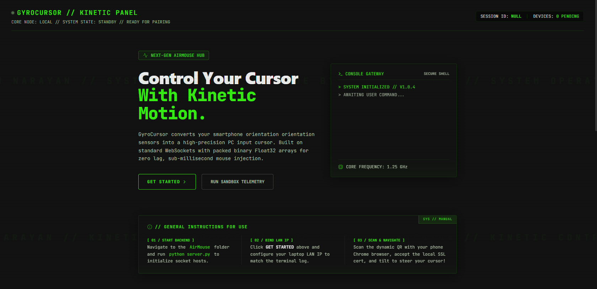
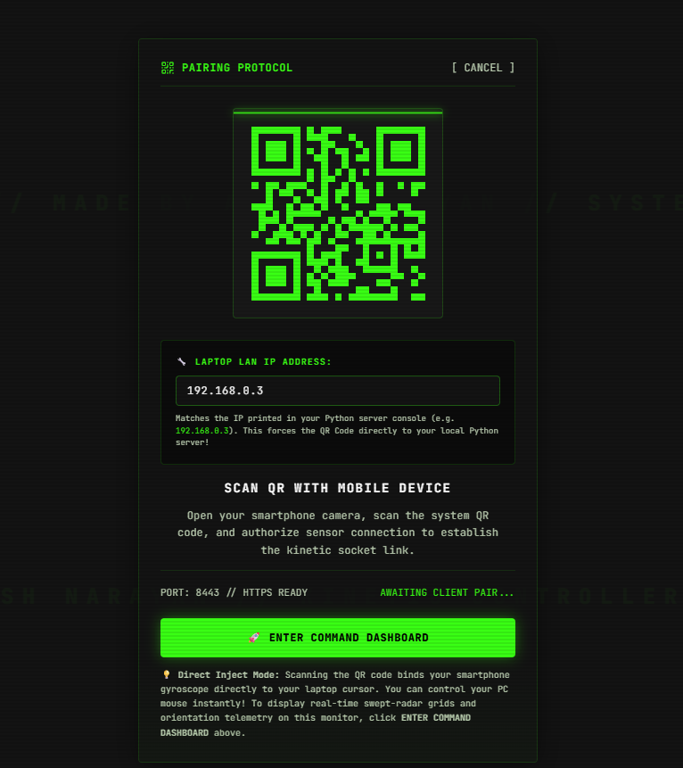

# 🖱️ Mouse_controller

Use your Android phone as a real-time wireless motion mouse — tilt your phone to control your laptop cursor just like pointing a smart TV remote.

Mouse_controller is a full-stack motion-control platform built using Python, WebSockets, smartphone gyroscope sensors, Android integration, and a modern interactive frontend website.

The project combines:
- Real-time motion tracking
- Wireless cursor interaction
- QR-based device pairing
- WebSocket communication
- Interactive frontend dashboard
- Live telemetry visualization
- Smartphone gyroscope control

---

# ✨ Features

- 📱 Control laptop cursor using phone motion
- ⚡ Real-time low-latency communication
- 📡 WebSocket-based architecture
- 🎯 Gyroscope and orientation tracking
- 🖥️ Modern frontend interface
- 📊 Live telemetry dashboard
- 🔒 HTTPS + WSS support
- 📲 QR-based instant connection
- 🌐 Responsive web interface
- 🎨 Futuristic UI animations
- 📶 Live connection monitoring
- 🧠 Motion telemetry visualization

---

# 📸 Screenshots

## Frontend Interface



---

## Live Dashboard



---

# 🚀 Quick Start

## Website Flow

1. Open the frontend website
2. Click on:
   ```text
   Get Started
   ```
3. The backend server starts the connection system
4. A QR code is generated dynamically
5. Scan the QR code using your phone
6. Allow gyroscope permissions
7. Tilt the phone to control the cursor in real time

---

# ⚙️ Manual Backend Setup

If you want to run the backend manually:

## 1. Install Python Dependencies

```bash
cd AirMouse
pip install -r requirements.txt
```

---

## 2. Start the Python Server

```bash
python server.py
```

The terminal will display something similar to:

```text
https://192.168.x.x:8443
```

---

## 3. Connect Your Phone

1. Connect laptop and phone to the same WiFi network
2. Open the generated HTTPS URL in Chrome on your phone
3. If Chrome shows:
   ```text
   Your connection is not private
   ```
   tap:
   ```text
   Advanced → Proceed
   ```
4. The motion controller interface opens
5. Tap:
   ```text
   Connect
   ```
6. Allow motion sensor permissions
7. Start controlling the cursor using phone motion

---

# 🎮 Controls

| Action | Function |
|---|---|
| Cursor Movement | Tilt phone |
| Left Click | Left Click button |
| Right Click | Right Click button |
| Double Click | Double button |
| Scroll | Scroll Up / Down |
| Pause Tracking | Tracking ON/OFF |
| Adjust Speed | Sensitivity slider |

---

# 📊 Project Architecture

```text
Phone Motion Sensors
        │
        ▼
DeviceOrientation API
        │
        ▼
WebSocket Communication
        │
        ▼
Python Backend Server
        │
        ▼
Cursor Processing Engine
        │
        ▼
Desktop Cursor Control
        │
        ▼
Frontend Dashboard Interface
```

---

# 🧠 Technologies Used

## Frontend
- Next.js
- React
- Tailwind CSS
- Framer Motion
- JavaScript

## Backend
- Python
- FastAPI
- WebSockets
- pyautogui

## Mobile
- Android Motion Sensors
- DeviceOrientation API

---

# 📂 Project Structure

```text
Mouse_controller/
│
├── AirMouse/               # Python motion backend
├── main_website/           # Frontend website
├── AirMouseClient/         # Android motion client
├── CursorBrowser/          # Android browser integration
├── gyroTCP/                # TCP communication experiments
├── UDP/                    # UDP communication experiments
├── 1st.png
├── 2nd.png
└── README.md
```

---

# 🌐 Frontend Setup

```bash
cd main_website
npm install
npm run dev
```

---

# 📡 Communication Flow

```text
Smartphone
    ↓
Motion Sensor Data
    ↓
WebSocket Transmission
    ↓
Python Backend Processing
    ↓
Cursor Rendering
    ↓
Frontend Telemetry Dashboard
```

---

# 📈 Telemetry Features

The frontend dashboard visualizes:
- Connection state
- Motion sensor values
- Alpha/Beta/Gamma data
- Signal status
- Device activity
- Motion tracking state
- Real-time interaction feedback

---

# 💡 Tips & Tricks

- Hold the phone parallel to the ground for smoother movement
- Lower sensitivity for precise control
- Increase sensitivity for faster movement
- Use Tracking ON/OFF while repositioning your hand
- Stable WiFi improves responsiveness
- Small wrist movements give better accuracy

---

# 🛠️ Troubleshooting

| Problem | Solution |
|---|---|
| Cannot connect | Ensure both devices are on same WiFi |
| Cursor jumps | Reduce sensitivity slider |
| Gyroscope not working | Use HTTPS instead of HTTP |
| Phone permissions blocked | Allow motion sensor permissions |
| Connection blocked | Allow ports through firewall |
| Cursor too sensitive | Lower sensitivity in controller |
| Delayed movement | Check WiFi stability |

---

# 🔒 Security Notes

- HTTPS is used for motion sensor access
- WSS is used for secure WebSocket communication
- Local network communication keeps latency low
- QR pairing helps simplify device connection

---

# 🔮 Future Improvements

- AI-based motion smoothing
- Gesture recognition
- Multi-device support
- Cloud-based pairing
- Public deployment
- Better motion calibration
- Remote internet-based control
- Voice command integration
- Haptic feedback support

---

# 👨‍💻 Author

Ayush Narayan

BTech ISE — BMS College of Engineering

---

# 📜 License

This project is licensed under the MIT License.

---

# ⭐ Project Goal

This project was developed to explore:
- motion intelligence
- real-time communication
- wireless interaction systems
- frontend/backend integration
- sensor-based computing
- interactive web technologies
- real-time device communication
